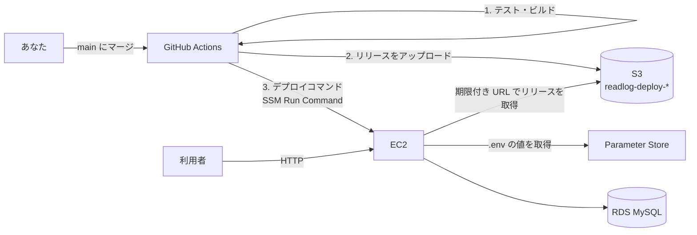

# AWS デプロイ手順（Step 1: EC2 + RDS）

設計書「7. インフラ構成（AWS）」の Step 1 を、AWS マネジメントコンソールで構築する手順。
作業は上から順に行う。**リージョンはすべて「アジアパシフィック（東京）ap-northeast-1」**。

## 全体像



- サーバーへの SSH は使わない（22 番ポートは開けない）。操作は Session Manager、デプロイは SSM Run Command で行う。
- アクセスキーは作らない。EC2 には IAM ロール、GitHub Actions には OIDC で権限を渡す。
- サーバーのセットアップ（Nginx・PHP など）は初回のデプロイで自動的に行われる（`deploy/server/provision.sh`）。

## 費用の目安

東京リージョンで常時起動した場合、**月 30 ドル前後**（EC2 t4g.micro・RDS db.t4g.micro・ストレージ・パブリック IPv4 の合計）。
無料枠やクレジットの対象になるかはアカウントによって異なるため、[料金ページ](https://aws.amazon.com/jp/pricing/) と請求ダッシュボードで確認すること。
使わない期間は「後片付け・節約」の手順で停止・削除する。

## 作業中にメモする値

途中で出てくる値を控えておく（後の手順で使う）。

| 名前 | 例 | どこで分かるか |
|---|---|---|
| アカウント ID | `123456789012` | コンソール右上のアカウント名 |
| バケット名 | `readlog-deploy-123456789012` | 手順 3 |
| RDS エンドポイント | `readlog-db.xxxx.ap-northeast-1.rds.amazonaws.com` | 手順 5 |
| DB パスワード | （自分で決める） | 手順 5 |
| インスタンス ID | `i-0123456789abcdef0` | 手順 6 |
| Elastic IP | `203.0.113.10` | 手順 6 |
| デプロイ用ロールの ARN | `arn:aws:iam::123456789012:role/readlog-github-deploy` | 手順 8 |

---

## 0. 事前準備（安全のため必ず行う）

1. **ルートユーザーに MFA を設定する**: 右上のアカウント名 →「セキュリティ認証情報」→「MFA を割り当てる」。
2. **普段使う管理者ユーザーを作る**: ルートユーザーでは作業しない。IAM Identity Center（推奨）か、IAM ユーザーに `AdministratorAccess` を付けて MFA を設定し、以降はそのユーザーでログインする。
3. **予算アラートを設定する**: 「Billing and Cost Management」→「予算」→「予算を作成」→ テンプレート「月次コスト予算」で、例えば 40 USD、通知先に自分のメールアドレスを設定する。

## 1. VPC（ネットワーク）

「VPC」→「VPC を作成」→ **「VPC など」** を選ぶ。

| 項目 | 値 |
|---|---|
| 名前タグの自動生成 | `readlog` |
| IPv4 CIDR | `10.0.0.0/16`（そのまま） |
| アベイラビリティーゾーン (AZ) の数 | 2 |
| パブリックサブネットの数 | 2 |
| プライベートサブネットの数 | 2 |
| NAT ゲートウェイ | **なし**（有料のため） |
| VPC エンドポイント | S3 ゲートウェイ（無料。そのままで良い） |

「VPC を作成」を押す。

## 2. セキュリティグループ（ファイアウォール）

「VPC」→「セキュリティグループ」→「セキュリティグループを作成」で 2 つ作る。VPC はどちらも `readlog-vpc` を選ぶ。

**readlog-web**（EC2 用）

| インバウンドルール | ポート | ソース |
|---|---|---|
| HTTP | 80 | `0.0.0.0/0` |
| HTTPS | 443 | `0.0.0.0/0` |

SSH（22）は**追加しない**。アウトバウンドはそのまま（すべて許可）。

**readlog-db**（RDS 用）

| インバウンドルール | ポート | ソース |
|---|---|---|
| MYSQL/Aurora | 3306 | セキュリティグループ `readlog-web` |

## 3. S3 バケット（デプロイするファイルの置き場所）

「S3」→「バケットを作成」。

| 項目 | 値 |
|---|---|
| バケット名 | `readlog-deploy-<アカウントID>`（世界で一意にするため） |
| パブリックアクセスをすべてブロック | オン（そのまま） |
| バージョニング | 無効（そのまま） |

作成後、バケット →「管理」→「ライフサイクルルールを作成」で、古いファイルを自動削除する。

| 項目 | 値 |
|---|---|
| ルール名 | `expire-releases` |
| プレフィックス | `releases/` |
| アクション | オブジェクトの現行バージョンを有効期限切れにする: 30 日 |

## 4. EC2 用の IAM ロール

「IAM」→「ロール」→「ロールを作成」。

1. 信頼されたエンティティ: **AWS のサービス** → ユースケース **EC2**
2. 許可ポリシー: **`AmazonSSMManagedInstanceCore`** にチェック（Session Manager と Run Command に必要）
3. ロール名: `readlog-ec2-role` で作成

作成したロールを開き、「許可を追加」→「インラインポリシーを作成」→「JSON」に
[`deploy/aws/ec2-role-policy.json`](../../deploy/aws/ec2-role-policy.json) の内容を貼り付ける。
`ACCOUNT_ID` を自分の値に置き換え、ポリシー名 `readlog-ec2-app` で作成する。

> このポリシーで許可しているのは「Parameter Store の `/readlog/production/` 以下を読む（SecureString の復号を含む）」ことだけ。リリースファイルは GitHub Actions が発行する期限付き URL（15 分）でダウンロードするので、EC2 に S3 の権限は不要。

## 5. RDS（MySQL）

「RDS」→「データベースの作成」→ **「標準作成」**。

| 項目 | 値 |
|---|---|
| エンジン | MySQL（バージョンは最新の 8.4 系、なければ 8.0 系） |
| テンプレート | 無料利用枠（表示されなければ「開発/テスト」） |
| 可用性 | 単一 AZ（シングル DB インスタンス） |
| DB インスタンス識別子 | `readlog-db` |
| マスターユーザー名 | `admin` |
| 認証情報管理 | **セルフマネージド**（Secrets Manager は有料のため使わない） |
| マスターパスワード | 自分で決めて控える（記号を含む 16 文字以上を推奨） |
| インスタンスクラス | バースト可能クラス `db.t4g.micro` |
| ストレージ | gp3、20 GiB、ストレージの自動スケーリングは**オフ** |
| コンピューティングリソース | EC2 コンピューティングリソースに接続しない |
| VPC | `readlog-vpc` |
| DB サブネットグループ | 新しく作成（自動で VPC のサブネットが使われる） |
| パブリックアクセス | **なし** |
| VPC セキュリティグループ | 既存の `readlog-db` を選び、`default` は外す |
| Performance Insights / 拡張モニタリング | オフ |
| 追加設定 → 最初のデータベース名 | **`readlog`** |
| バックアップ保持期間 | 1 日 |

作成には 10 分ほどかかる。完了したら DB を開き、「接続とセキュリティ」の **エンドポイント** を控える。

> 学習用なのでアプリからマスターユーザーで接続する。本格運用ではアプリ専用のユーザーを作り、権限を `readlog` データベースだけに絞る。

## 6. EC2（Web サーバー）

「EC2」→「インスタンスを起動」。

| 項目 | 値 |
|---|---|
| 名前 | `readlog-web` |
| AMI | **Ubuntu Server 24.04 LTS**、アーキテクチャ **64 ビット (Arm)** |
| インスタンスタイプ | `t4g.micro` |
| キーペア | **キーペアなしで続行**（Session Manager で接続するため） |
| ネットワーク設定 →「編集」 | VPC `readlog-vpc`、サブネットは **public** と付いたもの、パブリック IP の自動割り当て **有効** |
| ファイアウォール | 既存のセキュリティグループ `readlog-web` |
| ストレージ | 20 GiB gp3 |
| 高度な詳細 → IAM インスタンスプロフィール | `readlog-ec2-role` |
| 高度な詳細 → メタデータバージョン | V2 のみ（トークン必須）（デフォルト） |

起動したらインスタンス ID を控える。

続けて IP アドレスを固定する。「EC2」→「Elastic IP」→「Elastic IP アドレスを割り当てる」→ 割り当てた IP を選んで「アクション」→「Elastic IP アドレスの関連付け」で `readlog-web` に関連付け、IP を控える。

**接続の確認**: インスタンスを選んで「接続」→「Session Manager」→「接続」でターミナルが開けば OK（起動直後は数分かかることがある）。
開けない場合は IAM ロールが付いているか、サブネットがパブリックかを確認する。

## 7. Parameter Store（本番の .env の値）

「Systems Manager」→「パラメータストア」→「パラメータの作成」で、以下を 1 つずつ作る。
名前は**スラッシュも含めて正確に**入力する。

| 名前 | タイプ | 値 |
|---|---|---|
| `/readlog/production/APP_KEY` | **SecureString** | PC の `laravel-app` フォルダで `php artisan key:generate --show` を実行した結果（`base64:` から全部） |
| `/readlog/production/APP_URL` | String | `http://<Elastic IP>` |
| `/readlog/production/DB_HOST` | String | RDS のエンドポイント |
| `/readlog/production/DB_DATABASE` | String | `readlog` |
| `/readlog/production/DB_USERNAME` | String | `admin` |
| `/readlog/production/DB_PASSWORD` | **SecureString** | RDS のマスターパスワード |
| `/readlog/production/GOOGLE_BOOKS_API_KEY` | **SecureString** | Google Books の API キー |

- SecureString の KMS キーはデフォルトの `alias/aws/ssm` のままで良い。
- **Google Books の API キーは本番用に別に作るのがおすすめ**。「アプリケーションの制限」を「IP アドレス」にして Elastic IP を登録し、「API の制限」を Books API に絞る。
- 固定の設定値（`APP_ENV=production` など）は [`deploy/server/env.production`](../../deploy/server/env.production) に書いてある。デプロイのたびに、このファイルと Parameter Store の値を結合して `.env` を作る。

## 8. GitHub Actions 用の IAM ロール（OIDC）

### 8-1. ID プロバイダを登録する（アカウントで 1 回だけ）

「IAM」→「ID プロバイダ」→「プロバイダを追加」。

| 項目 | 値 |
|---|---|
| プロバイダのタイプ | OpenID Connect |
| プロバイダの URL | `https://token.actions.githubusercontent.com` |
| 対象者 | `sts.amazonaws.com` |

### 8-2. ロールを作る

「IAM」→「ロール」→「ロールを作成」→ 信頼されたエンティティ **「ウェブアイデンティティ」**。

| 項目 | 値 |
|---|---|
| アイデンティティプロバイダー | `token.actions.githubusercontent.com` |
| Audience | `sts.amazonaws.com` |
| GitHub 組織 | `y-suzuki-hub` |
| GitHub リポジトリ | `laravel-app` |

許可ポリシーは何も選ばずに進み、ロール名 `readlog-github-deploy` で作成する。

作成したロールを開いて、次の 2 つを設定する。

1. **「信頼関係」→「信頼ポリシーを編集」**: [`deploy/aws/github-trust-policy.json`](../../deploy/aws/github-trust-policy.json) の内容に置き換え、`ACCOUNT_ID` を自分の値にする。
   これで「このリポジトリの `production` 環境のジョブ」だけがロールを使えるようになる。
2. **「許可を追加」→「インラインポリシーを作成」→「JSON」**: [`deploy/aws/github-deploy-policy.json`](../../deploy/aws/github-deploy-policy.json) を貼り付け、`ACCOUNT_ID`・`BUCKET_NAME`・`INSTANCE_ID` を置き換えて `readlog-github-deploy` という名前で作成する。

ロールの **ARN** を控える。

## 9. GitHub の設定

### 9-1. production 環境と変数を作る

「Settings」→「Environments」→「New environment」→ 名前 **`production`**。

- 「Deployment branches and tags」: **Selected branches and tags** → `main` を追加（main 以外からのデプロイを防ぐ）
- 「Environment variables」に以下を追加する（秘密情報ではないので Secrets ではなく Variables で良い）

| 名前 | 値 |
|---|---|
| `AWS_REGION` | `ap-northeast-1` |
| `AWS_ROLE_ARN` | 手順 8 のロールの ARN |
| `AWS_INSTANCE_ID` | EC2 のインスタンス ID |
| `DEPLOY_BUCKET` | S3 のバケット名 |

### 9-2. main ブランチを作る

今のリポジトリには作業ブランチ（`claude/youthful-goodall-9t0bxq`）しかない。デプロイは `main` ブランチから行うので作成する。

1. リポジトリの「Code」タブ → ブランチ名のプルダウン → `main` と入力 →「Create branch main from claude/youthful-goodall-9t0bxq」
2. 「Settings」→「General」→「Default branch」を `main` に変更する

**main を作った時点で最初のデプロイが始まる**（9-1 を先に済ませておくこと）。
以降は作業ブランチから `main` へのプルリクエストをマージすると、自動でデプロイされる。

## 10. デプロイする

main を作った時点で「Actions」タブの **deploy** ワークフローが自動で動く（動いていなければ deploy →「Run workflow」→ main を選んで実行）。

1. `tests` ジョブ（テスト）→ `deploy` ジョブの順に進む
2. `deploy` ジョブの「Activate release on EC2」で、サーバー側の出力が表示される
   - **初回はサーバーのセットアップ（Nginx・PHP のインストール）を含むため 5〜10 分かかる**
3. 緑のチェックになったら `http://<Elastic IP>` を開く

本番にはサンプルデータは入れていないので、「Register」からユーザー登録して使い始める。

## うまくいかないとき

| 症状 | 確認すること |
|---|---|
| `Configure AWS credentials` で失敗 | 信頼ポリシーの `ACCOUNT_ID`、GitHub の環境名が `production` か、ジョブが main から実行されているか |
| `Upload release to S3` で AccessDenied | デプロイ用ポリシーの `BUCKET_NAME` |
| `Activate release on EC2` で `InvalidInstanceId` | インスタンス ID、EC2 が起動中か、Session Manager で接続できるか（SSM に登録されているか） |
| サーバー側のエラー | ワークフローのログに出るサーバーの出力。`Systems Manager`→`Run Command`→`コマンド履歴` でも確認できる |
| ページが 500 エラー | Session Manager で接続し、`sudo tail -n 50 /var/www/readlog/shared/storage/logs/laravel-*.log` |
| DB に接続できない | RDS のセキュリティグループ（`readlog-web` からの 3306 を許可しているか）、Parameter Store の `DB_*` の値 |

サーバー上のファイルの配置は次のとおり。

```
/var/www/readlog/
├── current -> releases/<最新のコミット>   # Nginx が参照する
├── releases/<コミット>/                   # 直近 5 リリースを保持
└── shared/
    ├── .env                               # デプロイのたびに生成
    └── storage/                           # ログ・セッションなど（リリース間で共有）
```

デプロイ後のヘルスチェック（`/up`）に失敗した場合は、自動的に直前のリリースに戻る。

## 後片付け・節約

- **一時的に止める**: EC2 を「停止」、RDS を「一時停止」。RDS は 7 日経つと自動で起動するので注意。Elastic IP は EC2 を停止していても課金される。
- **全部消す**: EC2 を終了 → Elastic IP を解放 → RDS を削除（最終スナップショットは任意）→ S3 バケットを空にして削除 → VPC を削除 → IAM ロール・Parameter Store のパラメータを削除。

## 次のステップ

- 独自ドメインと HTTPS（Route 53 + Let's Encrypt）
- 画像アップロードで S3、通知メールで SES、キューを SQS に切り替え（Phase 3 の機能と合わせて導入）
- この構成を Terraform でコード化（Step 2）
