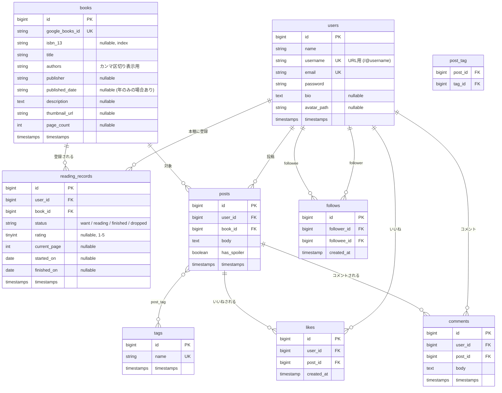

# 読書記録SNS 設計書

仮称: **ReadLog**（読んだ本・読んでいる本を記録し、感想を共有する SNS）

## 1. コンセプト

- 本を検索して「読みたい / 読んでいる / 読了 / 中断」のステータスで本棚に登録する
- 読書中のメモや読了後の感想を投稿し、タグで整理する
- 他のユーザーをフォローして、タイムラインで感想を見る・いいねする

### 想定ユーザー

- 技術書やビジネス書を読む社会人・学生
- 読書の進捗を見える化して継続したい人

## 2. 技術スタック

| 分類 | 採用技術 | 理由 |
|---|---|---|
| バックエンド | Laravel（最新版） / PHP 8.4 | 学習対象 |
| フロントエンド | Blade + Livewire（クラスベースコンポーネント） | PHP 中心で SPA 風の操作を実現できる |
| CSS | Tailwind CSS | スターターキット標準 |
| 認証 | 公式 Livewire スターターキット | ログイン・登録・パスワードリセットを標準の実装で用意 |
| DB | 開発: SQLite → 本番: MySQL or PostgreSQL | 手軽に始めて、本番は一般的な RDB に |
| テスト | Pest | Laravel 標準で、読みやすい |
| 外部 API | Google Books API | 書籍情報を入力せずに取得できる |
| キュー / スケジューラ | database ドライバ | 追加のミドルウェアなしで非同期処理を学べる |
| 静的解析 / 整形 | Laravel Pint、Larastan | 品質の担保 |
| CI | GitHub Actions | テストと Pint をプッシュごとに実行 |

## 3. 機能一覧とフェーズ

小さく動くものを作り、段階的に機能を足していく。

### Phase 1: MVP（本棚と投稿）

| # | 機能 | 学べること |
|---|---|---|
| 1-1 | ユーザー登録・ログイン・プロフィール編集 | 認証、スターターキットの構造 |
| 1-2 | 書籍検索（Google Books API） | HTTP クライアント、サービスクラス、キャッシュ、`Http::fake` によるテスト |
| 1-3 | 本棚への登録・ステータス変更・評価（★1〜5） | CRUD、Enum、バリデーション、Livewire |
| 1-4 | 感想・メモの投稿（作成 / 編集 / 削除） | CRUD、FormRequest / Livewire Form |
| 1-5 | 投稿へのタグ付け | 多対多（`belongsToMany`） |
| 1-6 | 他人の投稿は編集・削除できない | Policy による認可 |
| 1-7 | Feature テスト | Pest、Factory、RefreshDatabase |

### Phase 2: SNS 機能

| # | 機能 | 学べること |
|---|---|---|
| 2-1 | ユーザーページ（本棚・投稿一覧） | ルートモデルバインディング（username） |
| 2-2 | フォロー / フォロー解除 | 自己参照の多対多 |
| 2-3 | タイムライン（フォロー中ユーザーの投稿） | サブクエリ、Eager Loading（N+1 対策）、ページネーション |
| 2-4 | いいね（ページ遷移なし） | Livewire のアクション、ユニーク制約 |
| 2-5 | タグ別・書籍別の投稿一覧 | スコープ、クエリの組み立て |
| 2-6 | ネタバレ投稿の折りたたみ表示 | Alpine.js（Livewire 同梱）との連携 |

### Phase 3: 発展機能

| # | 機能 | 学べること |
|---|---|---|
| 3-1 | コメント | リレーションのネスト |
| 3-2 | 通知（フォローされた・いいね・コメント） | Notification（database / mail）、キュー |
| 3-3 | 週間人気の本ランキング | スケジューラ、集計クエリ、キャッシュ |
| 3-4 | アバター画像のアップロード | Storage、Livewire のファイルアップロード、画像バリデーション |
| 3-5 | 読書統計（月ごとの読了冊数グラフ） | 集計、グラフ表示 |

### Phase 4: 仕上げ

- GitHub Actions（Pest、Pint、Larastan）
- Laravel Sail（Docker）で起動できるようにする
- 本番環境へのデプロイ
- README（画面キャプチャ、ER 図、工夫した点）

## 4. ER 図



### 制約・インデックス

| テーブル | 制約 | 目的 |
|---|---|---|
| reading_records | UNIQUE(user_id, book_id) | 同じ本を二重に登録しない |
| reading_records | INDEX(user_id, status) | 「読書中の本」など本棚の絞り込み |
| posts | INDEX(user_id, created_at) | タイムライン・ユーザーページの新着順 |
| post_tag | PRIMARY(post_id, tag_id) | 重複タグ付けを防ぐ |
| likes | UNIQUE(user_id, post_id) | 二重いいねを防ぐ |
| follows | UNIQUE(follower_id, followee_id) | 二重フォローを防ぐ |
| 各 FK | `cascadeOnDelete()` | ユーザー・投稿削除時に関連データも削除 |

### 設計上の判断

- **books は全ユーザー共通のマスタ**。Google Books の検索結果は保存せず、ユーザーが本棚に登録した時点で `google_books_id` をキーに `firstOrCreate` する。同じ本を複数ユーザーが登録しても 1 レコードで済み、「この本を読んでいる人」「本ごとの感想一覧」が作れる。
- **ステータスは PHP の Backed Enum**（`App\Enums\ReadingStatus`）で表現し、DB は string カラムにする。ステータスの追加が容易で、DB 製品に依存しない。
- **投稿は reading_records ではなく book に紐づける**。本棚から外しても感想は残せる。
- **likes / follows は中間テーブルにも id を持たせる**。Eloquent の `belongsToMany` で扱いつつ、将来の通知などで個別レコードを参照しやすくする。
- **authors は正規化しない**（MVP では表示用の文字列）。著者で検索する要件が出たら `authors` テーブルに分離する。

## 5. 画面一覧・ルーティング

| 画面 | URL | 認証 | 実装 |
|---|---|---|---|
| トップ（未ログイン） | `/` | 不要 | Blade |
| ログイン / 登録 など | `/login` `/register` … | 不要 | スターターキット |
| タイムライン | `/home` | 必要 | Livewire |
| 書籍検索 | `/books/search` | 必要 | Livewire（入力に応じてリアルタイム検索） |
| 書籍詳細（感想一覧） | `/books/{book}` | 不要 | Livewire |
| 自分の本棚 | `/shelf` | 必要 | Livewire（ステータスのタブ切替） |
| 投稿作成 | `/posts/create?book={book}` | 必要 | Livewire |
| 投稿詳細 | `/posts/{post}` | 不要 | Livewire（いいね・コメント） |
| 投稿編集 | `/posts/{post}/edit` | 必要（本人のみ） | Livewire |
| タグ別一覧 | `/tags/{tag:name}` | 不要 | Livewire |
| ユーザーページ | `/@{user:username}` | 不要 | Livewire（本棚 / 投稿タブ、フォローボタン） |
| プロフィール設定 | `/settings/profile` | 必要 | スターターキットを拡張 |
| 通知 | `/notifications` | 必要 | Livewire（Phase 3） |

## 6. ディレクトリ構成（主要部分）

```
app/
├── Enums/ReadingStatus.php
├── Livewire/                 # 画面・部品ごとの Livewire コンポーネント
│   ├── Books/Search.php
│   ├── Shelf/Index.php
│   ├── Posts/{Create,Edit,Show}.php
│   ├── Timeline.php
│   ├── LikeButton.php
│   └── FollowButton.php
├── Models/{User,Book,ReadingRecord,Post,Tag,Comment}.php
├── Policies/{PostPolicy,ReadingRecordPolicy,CommentPolicy}.php
├── Services/GoogleBooks/
│   ├── GoogleBooksClient.php # API 呼び出し（Http ファサード）
│   └── BookData.php          # API レスポンスを詰める DTO
└── Notifications/            # Phase 3
```

### 実装方針

- **外部 API はサービスクラスに閉じ込める**。Livewire コンポーネントから直接 `Http::get` しない。テストでは `Http::fake()` で API をモックする。
- **検索結果は短時間キャッシュする**（同じキーワードで API を叩きすぎない）。
- **認可は Policy に集約**し、Livewire 側では `$this->authorize()` を呼ぶ。
- **一覧は必ず Eager Loading**（`with(['user', 'book', 'tags'])`、`withCount('likes')`）。開発環境では `Model::preventLazyLoading()` を有効にして N+1 を検出する。
- **テストの粒度**: 画面・操作ごとに Feature テスト（Livewire テスト）、Enum やサービスは Unit テスト。

## 7. 次のステップ

1. Laravel プロジェクトを作成（Livewire スターターキット、Pest）
2. マイグレーション・モデル・Factory を作成（ER 図の Phase 1 範囲）
3. Google Books API クライアントと書籍検索画面
4. 本棚（登録・ステータス変更）
5. 投稿 CRUD とタグ、Policy
6. Phase 1 の Feature テストを揃える
