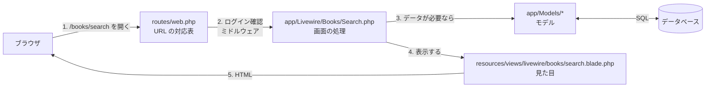
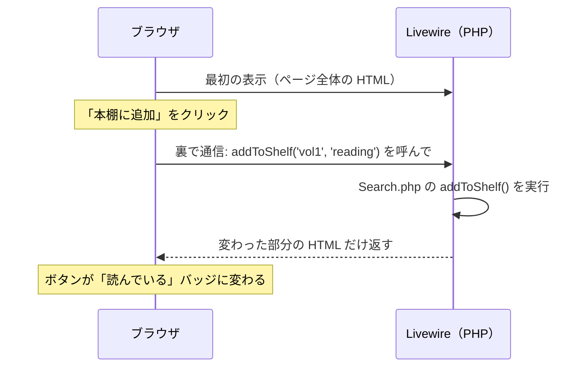

# ReadLog で学ぶ Laravel の仕組み

このガイドは、自分のアプリ（ReadLog）のコードを読みながら、Laravel がどう動いているかをつかむためのもの。
「本を検索して本棚に追加する」という 1 つの操作を、最初から最後まで追いかける。

## 読み方

- PC で `laravel-app` フォルダをエディタ（VS Code など）で開き、**ガイドと実際のファイルを並べて**読む
- VS Code なら `⌘ + P` でファイル名を入力するとすぐ開ける。`app/Livewire/Books/Search.php:70` のように書いてあるのは「70 行目」の意味
- 途中にある「**試してみる**」は、実際に手を動かすと理解が一気に進むので、なるべくやる
- 全部を一度に理解しなくて良い。1 章ずつ、分からない言葉は最後の「用語集」を見る

---

## 1. 全体の地図

### フォルダの役割

Laravel のプロジェクトはファイルが多いが、**普段触るのは次の 5 か所だけ**。

| フォルダ | 役割 | ReadLog での例 |
|---|---|---|
| `routes/` | **URL と処理の対応表**。「この URL に来たら、この処理を動かす」 | `routes/web.php` |
| `app/Livewire/` | **画面ごとの処理**（PHP）。ボタンが押されたら何をするか | `app/Livewire/Books/Search.php` |
| `app/Models/` | **データベースのテーブルを PHP で扱うクラス**（Eloquent モデル） | `app/Models/Book.php` |
| `resources/views/` | **画面の見た目**（HTML + Blade） | `resources/views/livewire/books/search.blade.php` |
| `database/migrations/` | **テーブルの設計図**。どんな列を持つか | `database/migrations/2026_09_30_000002_create_reading_records_table.php` |

ほかにも次のフォルダがある（たまに触る）。

| フォルダ | 役割 |
|---|---|
| `app/Policies/` | 「この人はこのデータを操作して良いか」の判定（認可） |
| `app/Enums/` | 決まった選択肢（読書ステータスなど）の定義 |
| `app/Services/` | 外部 API との通信など、画面に依存しない処理 |
| `tests/` | 自動テスト |
| `config/` | 設定。値の多くは `.env` から読む |
| `vendor/` | Laravel 本体などのライブラリ（**自分では編集しない**） |

### リクエストの流れ

ブラウザで URL を開いてから画面が表示されるまでの流れ。



### Livewire が加えるもの

ふつうの Laravel では「ボタンを押す → ページ全体を読み込み直す」。
Livewire を使うと、**ボタンを押したときに裏で PHP のメソッドが呼ばれ、画面の一部だけが書き換わる**。



JavaScript をほとんど書かずに、PHP だけで動きのある画面を作れるのが Livewire の特徴。

---

## 2. 「本棚に追加」を追いかける

ここからが本題。画面で「本を探す」→ キーワード入力 →「本棚に追加」→「読んでいる」を選ぶ、という操作の裏側を順番に見る。

### 2-1. URL を受け付ける — `routes/web.php`

```php
// routes/web.php:14-17
Route::middleware(['auth', 'verified'])->group(function () {
    Route::livewire('dashboard', Dashboard::class)->name('dashboard');

    Route::livewire('books/search', Books\Search::class)->name('books.search');
```

読み方:

- `Route::livewire('books/search', Books\Search::class)` … **`/books/search` にアクセスが来たら、`Search` という Livewire コンポーネントを表示する**
- `->name('books.search')` … このルートに名前を付ける。画面側では `route('books.search')` と書けば URL が作られる（URL を変えても名前で参照している箇所は直さなくて良い）
- `Route::middleware(['auth', ...])->group(...)` … 中のルートは**ログインしていないと使えない**。ログインしていなければ自動でログイン画面に飛ばされる（この仕組みを**ミドルウェア**と呼ぶ）

> **試してみる**: ターミナルで `php artisan route:list --except-vendor` を実行すると、アプリの全 URL の一覧が出る。ログアウトした状態で http://localhost:8000/books/search を開き、ログイン画面に飛ばされることも確認する。

### 2-2. 画面の処理 — `app/Livewire/Books/Search.php`

Livewire コンポーネントは、**画面の状態（プロパティ）** と **画面から呼べる操作（メソッド）** を持つクラス。

```php
// app/Livewire/Books/Search.php:21-25
#[Title('本を探す')]
class Search extends Component
{
    #[Url(as: 'q', except: '')]
    public string $keyword = '';
```

- `public string $keyword` … **検索キーワード（画面の状態）**。public なプロパティは画面と自動で同期される
- `#[Url(as: 'q')]` … キーワードを URL の `?q=...` にも反映する（リロードしても検索結果が残る）
- `#[Title('本を探す')]` … ブラウザのタブに出るタイトル

```php
// app/Livewire/Books/Search.php:90-93
public function render(): View
{
    return view('livewire.books.search');
}
```

- `render()` … **どの見た目（ビュー）を使うか**。`livewire.books.search` は `resources/views/livewire/books/search.blade.php` のこと（`.` がフォルダの区切り）

### 2-3. 見た目 — `resources/views/livewire/books/search.blade.php`

ビューは HTML に **Blade** という書き方を混ぜたもの。`{{ }}` や `@if` が Blade。

```blade
{{-- search.blade.php:4-10 --}}
<flux:input
    wire:model.live.debounce.500ms="keyword"
    icon="magnifying-glass"
    placeholder="タイトル・著者名・ISBN で検索"
    clearable
    autofocus
/>
```

- `<flux:input>` … Flux（Livewire 用の部品集）の入力欄
- `wire:model.live.debounce.500ms="keyword"` … **入力欄と `$keyword` プロパティをつなぐ**。入力が 0.5 秒止まったら、裏で PHP 側の `$keyword` が更新され、画面が書き換わる

キーワードが変わると、検索結果の部分が表示し直される。検索結果はここで使われている。

```blade
{{-- search.blade.php:14-16 --}}
@if ($this->results === null)
    <flux:callout variant="danger" ... heading="検索に失敗しました。..." />
@elseif (mb_strlen(trim($keyword)) >= 2 && $this->results->isEmpty())
```

`$this->results` は、PHP 側のこのメソッドの結果。

```php
// app/Livewire/Books/Search.php:32-46
#[Computed]
public function results(): ?Collection
{
    if (mb_strlen(trim($this->keyword)) < 2) {
        return collect();
    }

    try {
        return app(GoogleBooksClient::class)->search($this->keyword);
    } catch (RequestException|ConnectionException $e) {
        // ...失敗したらログに残して null を返す
        return null;
    }
}
```

- `#[Computed]` … **計算で求める値**。ビューから `$this->results` と書くと呼ばれ、1 回のリクエストの中では結果が使い回される
- `app(GoogleBooksClient::class)` … Google Books API と通信するクラス（`app/Services/GoogleBooks/GoogleBooksClient.php`）を取り出して、`search()` を呼ぶ
- 2 文字未満なら API を呼ばずに空の結果を返す

### 2-4. ボタンを押す — `wire:click`

検索結果の各行には「本棚に追加」のメニューがある。

```blade
{{-- search.blade.php:46-50 --}}
@foreach (\App\Enums\ReadingStatus::cases() as $option)
    <flux:menu.item wire:click="addToShelf('{{ $book->googleBooksId }}', '{{ $option->value }}')">
        {{ $option->label() }}
    </flux:menu.item>
@endforeach
```

- `@foreach` … 読書ステータスの選択肢（読みたい・読んでいる・読み終わった・中断）の数だけメニューを並べる
- `wire:click="addToShelf('vol1', 'reading')"` … **クリックされたら PHP の `addToShelf()` メソッドを、この引数で呼ぶ**
- `{{ $option->label() }}` … `{{ }}` は値を画面に出す。中身は自動でエスケープされるので、HTML を埋め込まれる攻撃（XSS）を防げる

### 2-5. 追加の処理 — `addToShelf()`

クリックで呼ばれるのがこのメソッド。**このアプリで一番 Laravel らしい部分**なので、1 行ずつ見る。

```php
// app/Livewire/Books/Search.php:70-88
public function addToShelf(string $googleBooksId, string $status = 'want'): void
{
    $status = ReadingStatus::tryFrom($status) ?? abort(422);                 // ①

    $data = $this->results?->firstWhere('googleBooksId', $googleBooksId)     // ②
        ?? app(GoogleBooksClient::class)->find($googleBooksId)
        ?? abort(404);

    $book = Book::fromBookData($data);                                        // ③

    $record = Auth::user()->readingRecords()->firstOrNew(['book_id' => $book->id]); // ④

    if (! $record->exists) {                                                  // ⑤
        $record->changeStatus($status);
    }

    unset($this->shelved);                                                    // ⑥
}
```

| | していること |
|---|---|
| ① | 文字列 `'reading'` を、ステータスの型（Enum）`ReadingStatus::Reading` に変換する。存在しない値なら 422 エラーで止める（画面からは不正な値を送れてしまうので、必ず確認する） |
| ② | 画面に表示していた検索結果から、クリックされた本のデータを探す |
| ③ | 本を `books` テーブルに保存する（→ 2-6） |
| ④ | 「ログイン中のユーザーの、この本の本棚レコード」を探す。なければ**保存前の新しいレコード**を作る（→ 2-7） |
| ⑤ | 新しいレコードのときだけ、ステータスを設定して保存する（同じ本を 2 回追加しても重複しない） |
| ⑥ | 「登録済みの本」の計算結果を捨てる。次の表示で計算し直され、ボタンがバッジに変わる |

### 2-6. 本を保存する — モデル `app/Models/Book.php`

**モデル**は、データベースのテーブル 1 つに対応するクラス。`Book` モデルは `books` テーブルに対応する（クラス名を複数形にしたものがテーブル名になる決まり）。

```php
// app/Models/Book.php:31-37
public static function fromBookData(BookData $data): self
{
    return self::updateOrCreate(
        ['google_books_id' => $data->googleBooksId],
        $data->toAttributes(),
    );
}
```

- `updateOrCreate(探す条件, 保存する値)` … **`google_books_id` が一致する行があれば更新、なければ新しく作る**。SQL を書かなくても、モデルのメソッドで DB を操作できる。これを **Eloquent**（Laravel の ORM）と呼ぶ
- 同じ本を何人が登録しても `books` テーブルには 1 行だけ、という設計（`docs/design.md` の「設計上の判断」）を、この 1 メソッドで実現している

### 2-7. ユーザーと本棚をつなぐ — リレーション

④ の `Auth::user()->readingRecords()` は、`User` モデルに書いた**リレーション（テーブル同士の関係）**を使っている。

```php
// app/Models/User.php:86-89
public function readingRecords(): HasMany
{
    return $this->hasMany(ReadingRecord::class);
}
```

- `hasMany` … **1 人のユーザーは、本棚レコードを複数持つ**（1 対 多）
- `Auth::user()` … ログイン中のユーザー
- `Auth::user()->readingRecords()` … 「ログイン中のユーザーの本棚レコードだけ」に絞り込んだ状態から始められる。`firstOrNew` で作った新しいレコードには、`user_id` が自動で入る

逆向きの関係は `ReadingRecord` 側に書いてある。

```php
// app/Models/ReadingRecord.php:60-71
public function user(): BelongsTo   { return $this->belongsTo(User::class); }
public function book(): BelongsTo   { return $this->belongsTo(Book::class); }
```

`belongsTo` は「このレコードは 1 人のユーザー（1 冊の本）に属する」。これで `$record->book->title` のように、本棚レコードから本のタイトルをたどれる。

### 2-8. ステータスを変えて保存する — `changeStatus()`

⑤ で呼んでいるのは、`ReadingRecord` モデルに自分で書いたメソッド。

```php
// app/Models/ReadingRecord.php:39-55
public function changeStatus(ReadingStatus $status): void
{
    $this->status = $status;

    if ($status === ReadingStatus::Reading) {
        $this->started_on ??= today();
    }

    if ($status === ReadingStatus::Finished) {
        $this->started_on ??= today();
        $this->finished_on ??= today();
    } else {
        $this->finished_on = null;
    }

    $this->save();
}
```

- 「読んでいる」にしたら読み始めた日、「読み終わった」にしたら読み終わった日を自動で記録する
- `??=` は「まだ値がなければ代入する」。一度記録した日付は上書きしない
- `$this->save()` で、ここで初めて `INSERT`（新規）か `UPDATE`（既存）の SQL が実行される

このような「データのルール」をモデルに書いておくと、本棚画面（`app/Livewire/Shelf/Index.php`）からステータスを変えたときも同じルールが使われる。

**型の変換（キャスト）** も見ておく。

```php
// app/Models/ReadingRecord.php:25-34
protected function casts(): array
{
    return [
        'status' => ReadingStatus::class,
        'rating' => 'integer',
        // ...
        'started_on' => 'date',
        'finished_on' => 'date',
    ];
}
```

DB には `status` が `'reading'` という文字列で入っているが、PHP で読むと自動で `ReadingStatus::Reading` に変わる。日付も文字列ではなく日付のオブジェクトになり、`$record->started_on->format('Y/m/d')` のように使える。

### 2-9. ステータスの選択肢 — Enum `app/Enums/ReadingStatus.php`

```php
// app/Enums/ReadingStatus.php:5-20
enum ReadingStatus: string
{
    case Want = 'want';
    case Reading = 'reading';
    case Finished = 'finished';
    case Dropped = 'dropped';

    public function label(): string
    {
        return match ($this) {
            self::Want => '読みたい',
            self::Reading => '読んでいる',
            // ...
        };
    }
```

決まった選択肢を 1 か所にまとめておくと、画面の表示名（`label()`）や色（`color()`）もここで管理できる。選択肢を増やすときも、このファイルを直せば画面のメニューにも自動で出る（2-4 の `ReadingStatus::cases()` が全選択肢を返すため）。

### 2-10. テーブルの設計図 — マイグレーション

ここまで出てきた `reading_records` テーブルは、マイグレーションで定義している。

```php
// database/migrations/2026_09_30_000002_create_reading_records_table.php:11-24
Schema::create('reading_records', function (Blueprint $table) {
    $table->id();
    $table->foreignId('user_id')->constrained()->cascadeOnDelete();
    $table->foreignId('book_id')->constrained()->cascadeOnDelete();
    $table->string('status', 20);
    $table->unsignedTinyInteger('rating')->nullable();
    $table->unsignedInteger('current_page')->nullable();
    $table->date('started_on')->nullable();
    $table->date('finished_on')->nullable();
    $table->timestamps();

    $table->unique(['user_id', 'book_id']);
    $table->index(['user_id', 'status']);
});
```

- `foreignId('user_id')->constrained()` … `users` テーブルの `id` を指す列（外部キー）。`cascadeOnDelete()` でユーザーを消すと本棚も消える
- `nullable()` … 空でも良い列
- `timestamps()` … 作成日時 `created_at` と更新日時 `updated_at` を自動で管理する列
- `unique(['user_id', 'book_id'])` … **同じユーザーが同じ本を 2 回登録できない**ように、DB 側でも防ぐ
- `php artisan migrate` を実行すると、この設計図どおりにテーブルが作られる。本番へのデプロイでも同じコマンドが動いている

> **試してみる（tinker）**: ターミナルで `php artisan tinker` を実行すると、アプリのコードを 1 行ずつ試せる。
>
> ```php
> $user = App\Models\User::where('email', 'test@example.com')->first();
> $user->readingRecords()->with('book')->get()->map(fn ($r) => [$r->book->title, $r->status->label()]);
> App\Models\ReadingRecord::first()->book->title;
> ```
>
> 画面で本棚に追加したあとにもう一度実行すると、増えているのが分かる。終わるときは `exit`。

---

## 3. 他人のデータを守る — Policy（認可）

本棚画面では、ステータスの変更や削除ができる。ここで大事なのは「**他人の本棚は変更できない**」こと。

画面から送られてくるレコード ID は、ブラウザの開発者ツールで書き換えられる。そのため、サーバー側で必ず確認する。

```php
// app/Livewire/Shelf/Index.php:63-71
public function changeStatus(int $recordId, string $status): void
{
    $record = $this->findRecord($recordId);
    $this->authorize('update', $record);       // ← ここで確認

    $record->changeStatus(ReadingStatus::tryFrom($status) ?? abort(422));
    // ...
}
```

`$this->authorize('update', $record)` を呼ぶと、Laravel が `ReadingRecord` 用の **Policy** を自動で探して判定する。

```php
// app/Policies/ReadingRecordPolicy.php:10-13
public function update(User $user, ReadingRecord $record): bool
{
    return $user->id === $record->user_id;
}
```

- **ログイン中のユーザーの ID と、レコードの持ち主の ID が同じときだけ OK**
- 違えば 403（Forbidden）エラーになり、それ以降の処理は動かない
- `ReadingRecord` モデルに対する Policy は `ReadingRecordPolicy` という名前で `app/Policies/` に置く、という**命名の決まり**で自動的に結びつく（設定ファイルに書く必要がない）

Laravel にはこのような「決まった場所に、決まった名前で置けば自動でつながる」仕組みが多い（**設定より規約**）。最初は魔法のように見えるが、規約を知ると読めるようになる。

---

## 4. テストで動作を確かめる

`tests/` には、画面を手で操作しなくても動作を確認できる自動テストがある。2 章の流れは、このテストで確かめている。

```php
// tests/Feature/Books/SearchTest.php:57-71
it('adds a book to the shelf', function () {
    Livewire::actingAs($this->user)                   // このユーザーでログインした状態で
        ->test(Search::class)                         // 「本を探す」画面を開き
        ->set('keyword', 'リーダブル')                 // キーワードを入力して
        ->call('addToShelf', 'vol1', 'reading')       // 「本棚に追加 → 読んでいる」を押すと
        ->assertSee('読んでいる');                     // 画面に「読んでいる」と出る

    $book = Book::where('google_books_id', 'vol1')->sole();

    expect($book->title)->toBe('リーダブルコード')     // 本が保存されていて
        ->and($this->user->readingRecords()->sole())  // 本棚レコードが 1 件あり
        ->book_id->toBe($book->id)
        ->status->toBe(ReadingStatus::Reading)        // ステータスが「読んでいる」で
        ->started_on->not->toBeNull();                // 読み始めた日が入っている
});
```

テストでは本物の Google Books API は呼ばず、同じファイルの先頭（`beforeEach`）で `Http::fake()` を使って偽の応答を返している。

3 章の Policy も、「他人の本棚を変更しようとすると 403 になる」ことをテストしている（`tests/Feature/Shelf/ShelfTest.php:76`）。

> **試してみる**:
>
> ```bash
> ./vendor/bin/pest                                  # 全テストを実行
> ./vendor/bin/pest --filter="adds a book"           # 名前で絞って 1 つだけ実行
> ```
>
> 次に、`app/Policies/ReadingRecordPolicy.php` の `update()` を一時的に `return true;` に書き換えてから、もう一度全テストを実行する。**他人の本棚を変更できてしまう**ので、テストが失敗するはず。確認したら元に戻す。テストが「壊れたことを教えてくれる」感覚がつかめる。

---

## 5. 自分で動かして確かめる

読むだけより、少し変えて結果を見るほうが早く理解できる。どれも元に戻せば問題ない（`git checkout .` で全部元に戻せる）。

1. **表示名を変える**: `app/Enums/ReadingStatus.php` の `'読みたい'` を `'積読'` に変えて、本を探す画面と本棚画面を見る。1 か所変えただけで全画面に反映される
2. **処理の途中を覗く**: `app/Livewire/Books/Search.php` の `addToShelf()` の `$book = Book::fromBookData($data);` の次の行に `dd($book->toArray());` を入れて、「本棚に追加」を押す。保存された本のデータが画面に表示されて処理が止まる（`dd` は "dump and die"。デバッグでよく使う）
3. **実行された SQL を見る**: `php artisan tinker` で次を実行すると、Eloquent が裏で実行している SQL が分かる

   ```php
   DB::enableQueryLog();
   App\Models\User::first()->readingRecords()->with('book')->get();
   DB::getQueryLog();
   ```

4. **ログを見る**: `composer run dev` を動かしているターミナルの `[logs]` の行や、`storage/logs/laravel.log` に、エラーや `Log::warning()` の内容が出る

---

## 6. 用語集

| 用語 | 意味 | ReadLog での場所 |
|---|---|---|
| ルート（Route） | URL と処理の対応 | `routes/web.php` |
| ミドルウェア | 処理の前に挟むチェック（ログイン確認など） | `Route::middleware(['auth'])` |
| Livewire コンポーネント | 画面の状態と操作を持つ PHP クラス + ビュー | `app/Livewire/` |
| Blade | HTML に `{{ }}` や `@if` を混ぜて書けるテンプレート | `resources/views/` |
| Eloquent（モデル） | テーブルを PHP のクラスとして扱う仕組み | `app/Models/` |
| リレーション | テーブル同士の関係（`hasMany`、`belongsTo` など） | `User::readingRecords()` |
| マイグレーション | テーブルの設計図。`php artisan migrate` で反映 | `database/migrations/` |
| キャスト | DB の値を PHP の型に自動変換する設定 | `ReadingRecord::casts()` |
| Enum | 決まった選択肢の型 | `app/Enums/ReadingStatus.php` |
| Policy | 「この操作をして良いか」の判定 | `app/Policies/` |
| ファサード | `Auth::user()` や `Log::warning()` のような、よく使う機能の呼び出し口 | `Auth`、`Log`、`Http` |
| コレクション | 配列を便利に扱うクラス（`map`、`pluck`、`firstWhere` など） | `collect()`、検索結果 |
| Factory / Seeder | テストや開発用のダミーデータを作る仕組み | `database/factories/`、`database/seeders/` |
| artisan | Laravel のコマンドラインツール | `php artisan ...` |
| tinker | アプリのコードを対話的に試せるツール | `php artisan tinker` |

---

## 7. 次に読むもの

1. **ほかの画面も同じ流れで読む**: 本棚画面 `app/Livewire/Shelf/Index.php` と `resources/views/livewire/shelf/index.blade.php`。2 章と同じ「ルート → コンポーネント → モデル → ビュー」の流れで読めるはず
2. **フォームと入力チェック**: 感想の投稿 `app/Livewire/Posts/Create.php` と `app/Livewire/Forms/PostForm.php`。`rules()` に書いた入力チェック（バリデーション）と、多対多のリレーション（タグ）が出てくる
3. **公式ドキュメント**（日本語訳）: [Laravel 日本語ドキュメント](https://readouble.com/laravel/)（ルーティング、Eloquent、マイグレーション、認可の章）、[Livewire 公式ドキュメント](https://livewire.laravel.com/docs)（英語。Properties、Actions、Computed Properties の章）

読み終わったら、小さな機能を自分で書いてみる段階に進む（例: 本棚で「何ページまで読んだか」を入力・表示できるようにする。DB の列 `current_page` はもう用意してある）。
