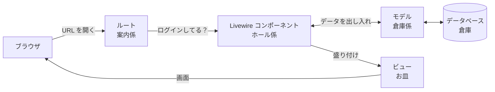

# ReadLog で学ぶ Laravel の仕組み

自分のアプリ（ReadLog）を使って、Laravel がどう動いているかをつかむためのガイド。
「**本を検索して、本棚に追加する**」という 1 つの操作の裏側を、順番にのぞいていく。

## このガイドの読み方

- 各章は同じ順番で書いてある
  1. **たとえ** … まず身近なものに置き換えてイメージをつかむ
  2. **コードのどこか** … 実際のファイルと行番号
  3. **なぜこう書くのか** … この書き方だと何がうれしいのか
  4. **試してみる** … 手を動かして確かめる（ここが一番大事）
- PC の VS Code で `laravel-app` フォルダを開き、ガイドとコードを並べて読む。`⌘ + P` でファイル名を入れるとすぐ開ける
- `routes/web.php:17` と書いてあったら「`routes/web.php` の 17 行目」のこと
- 試すときは `composer run dev` でアプリを起動しておく。コードを書き換えて試したら、最後に `git checkout .` で元に戻せる
- 一度に全部わからなくて大丈夫。1 章ずつ進める

---

## 1章 全体像 — Laravel は「レストラン」

### たとえ

ブラウザで ReadLog を使うことを、レストランで注文することにたとえる。

| レストラン | Laravel | フォルダ |
|---|---|---|
| 入口の**案内係**。「本を探したい」と言われたら、担当のテーブルに案内する | **ルート** — URL を見て、どの処理に回すか決める | `routes/` |
| 入口の**会員証チェック**。会員以外は入れない | **ミドルウェア** — ログインしていない人をログイン画面に帰す | `routes/web.php` の中 |
| **ホール係**。注文を聞いて、倉庫係に材料を頼み、料理を出す | **Livewire コンポーネント** — 画面の処理を担当する | `app/Livewire/` |
| **倉庫係**。倉庫から材料を出し入れする | **モデル** — データベースの読み書きを担当する | `app/Models/` |
| **倉庫** | **データベース** — 本や本棚のデータが入っている | （SQLite / MySQL） |
| 倉庫の**棚の設計図** | **マイグレーション** — どんな表（テーブル）を作るか | `database/migrations/` |
| **お皿と盛り付け** | **ビュー** — 画面の見た目（HTML） | `resources/views/` |
| 「**これはあなたの注文ですか？**」の確認 | **Policy** — 他人のデータを操作させない | `app/Policies/` |

### 流れ



これから「本を本棚に追加する」操作で、この順番に登場人物を見ていく。

---

## 2章 ルート — URL の案内係

### たとえ

ルートは「**この URL に来た人は、この担当に回す**」という**案内表**。

### コードのどこか

`routes/web.php:17`

```php
Route::livewire('books/search', Books\Search::class)->name('books.search');
//               ↑ この URL に来たら  ↑ この担当（画面の処理）に回す   ↑ 名前（あだ名）
```

http://localhost:8000/books/search を開くと、`app/Livewire/Books/Search.php` が担当になる。

### URL に名前を付ける理由

**スマホの連絡帳と同じ**。

- 電話番号 `090-1234-5678` ＝ 実際の URL `/books/search`
- 登録名「田中さん」＝ ルートの名前 `books.search`

画面にリンクを作るときは、URL を直接書かずに名前で呼ぶ。

```blade
{{-- 左のメニュー resources/views/components/layouts/app/sidebar.blade.php:18 --}}
<flux:navlist.item :href="route('books.search')" ...>本を探す</flux:navlist.item>

{{-- 本棚画面のボタン resources/views/livewire/shelf/index.blade.php:4 --}}
<flux:button :href="route('books.search')" ...>本を探す</flux:button>
```

`route('books.search')` は、案内表を見て `/books/search` に置き換えてくれる。
URL を `/search` に変えたくなっても、`routes/web.php` の 1 か所を直すだけで、全部のリンクが新しい URL になる。
URL を直接書いていたら、リンクを書いた場所を全部探して直す必要がある（ReadLog では 4 か所）。

> **試してみる**
> 1. `routes/web.php:17` の `'books/search'` を `'search'` に変えて保存する
> 2. ブラウザで左のメニューの「本を探す」を押す → アドレスバーが `/search` になり、ちゃんと開ける
> 3. 確認したら `'books/search'` に戻す

### 会員証チェック（ミドルウェア）

`routes/web.php:14-22`

```php
Route::middleware(['auth', 'verified'])->group(function () {
    Route::livewire('books/search', ...);     // ← この中 → ログインが必要
    Route::livewire('shelf', ...);
    // ...
});

Route::livewire('books/{book}', ...);         // ← 外 → 誰でも見られる（25 行目）
```

`Route::middleware(['auth'])->group(...)` の**中に書いた URL は、入口で会員証（ログイン）をチェック**される。ログインしていない人はログイン画面に帰される。
書籍ページ（`books/{book}`）は外に書いてあるので、ログインしていなくても見られる。

> **試してみる**
> 1. ターミナルで `php artisan route:list -v --path=books` を実行する。各 URL の下に、かかっているチェックが表示される
>    - `books/search` の下には `Authenticate`（ログインのチェック）がある
>    - `books/{book}` の下にはない
> 2. ブラウザでログアウトする（左下のユーザー名 → Log Out）
> 3. http://localhost:8000/books/search を開く → ログイン画面に飛ばされる
> 4. http://localhost:8000/books/1 を開く → そのまま見られる

---

## 3章 Livewire コンポーネントとビュー — ホール係とお皿

### たとえ

ホール係（コンポーネント）は**メモ帳**を持っていて、お客さんの注文（入力したキーワードなど）を書き留める。
メモ帳の内容が変わると、すぐに料理（画面）を作り直して出し直す。

ReadLog の「本を探す」画面は、次の 2 つのファイルでできている。

| ファイル | 役割 |
|---|---|
| `app/Livewire/Books/Search.php` | ホール係（PHP）。メモ帳と、ボタンが押されたときの処理 |
| `resources/views/livewire/books/search.blade.php` | お皿（HTML）。画面の見た目 |

### メモ帳（プロパティ）

`app/Livewire/Books/Search.php:24-25`

```php
#[Url(as: 'q', except: '')]
public string $keyword = '';
```

`$keyword` が**検索キーワードを書き留めるメモ帳**。最初は空っぽ（`''`）。

### 入力欄とメモ帳をつなぐ（wire:model）

`resources/views/livewire/books/search.blade.php:4-5`

```blade
<flux:input
    wire:model.live.debounce.500ms="keyword"
```

`wire:model="keyword"` は、**入力欄とメモ帳 `$keyword` を糸でつなぐ**指定。

- 入力欄に「リーダブル」と打つ
- 打つのが 0.5 秒止まると（`debounce.500ms`）、ブラウザが裏でサーバーに「メモ帳を『リーダブル』に書き換えて」と伝える
- メモ帳が変わったので、Livewire が画面を作り直し、検索結果が表示される

ページ全体を読み込み直さずに、画面の一部だけが変わる。**JavaScript を書かずに、PHP だけでこの動きが作れる**のが Livewire の特徴。

### 画面に値を差し込む（Blade）

ビューは HTML に、`{{ }}` や `@if`、`@foreach` を混ぜた **Blade** という書き方でできている。

`resources/views/livewire/books/search.blade.php:21,26`

```blade
@foreach ($this->results ?? [] as $book)     {{-- 検索結果の本の数だけ繰り返す --}}
    <p class="font-semibold">{{ $book->title }}</p>     {{-- 本のタイトルを差し込む --}}
```

- `@foreach ... @endforeach` … 繰り返し
- `{{ $book->title }}` … 値を画面に差し込む

`$this->results` は検索結果。`Search.php:32-46` の `results()` メソッドが、Google Books に問い合わせて本の一覧を返している。

### どのお皿を使うか（render）

`app/Livewire/Books/Search.php:90-93`

```php
public function render(): View
{
    return view('livewire.books.search');
}
```

「`resources/views/livewire/books/search.blade.php` のお皿に盛り付ける」という指定。ファイルの場所の `/` を `.` に変えて書く決まり。

> **試してみる**
> 1. `resources/views/livewire/books/search.blade.php:2` の `本を探す` を `本を検索する` に変えて保存する
> 2. ブラウザの「本を探す」画面を再読み込みする → 見出しが変わる
> 3. 確認したら元に戻す

---

## 4章 ボタンを押すと何が起きるか — wire:click と addToShelf

### たとえ

お客さんが「この本を、読んでいる棚に入れて」と注文する。ホール係は、

1. 注文の内容がおかしくないか確認する
2. 倉庫に本を登録する
3. その人の本棚に、その本を置く
4. 「置きました」と画面を出し直す

### ボタンとメソッドをつなぐ（wire:click）

`resources/views/livewire/books/search.blade.php:46-48`

```blade
@foreach (\App\Enums\ReadingStatus::cases() as $option)
    <flux:menu.item wire:click="addToShelf('{{ $book->googleBooksId }}', '{{ $option->value }}')">
        {{ $option->label() }}
```

「本棚に追加」のメニューには「読みたい・読んでいる・読み終わった・中断」が並ぶ。
`wire:click="addToShelf('vol1', 'reading')"` は「**押されたら、PHP の `addToShelf` を、この 2 つの値を渡して呼ぶ**」という意味。

### 注文を処理する（addToShelf）

`app/Livewire/Books/Search.php:70-88`。ボタンを押すとこのメソッドが動く。

```php
public function addToShelf(string $googleBooksId, string $status = 'want'): void
{
    // ① 注文の内容を確認する
    $status = ReadingStatus::tryFrom($status) ?? abort(422);

    // ② 画面に出していた検索結果から、押された本のデータを探す
    $data = $this->results?->firstWhere('googleBooksId', $googleBooksId)
        ?? app(GoogleBooksClient::class)->find($googleBooksId)
        ?? abort(404);

    // ③ 本を倉庫（books テーブル）に登録する
    $book = Book::fromBookData($data);

    // ④ この人の本棚に、この本がもうあるか探す。なければ新しく用意する
    $record = Auth::user()->readingRecords()->firstOrNew(['book_id' => $book->id]);

    // ⑤ 新しく用意したときだけ、ステータスを設定して保存する
    if (! $record->exists) {
        $record->changeStatus($status);
    }

    // ⑥ 「本棚にある本」の情報を作り直させる → ボタンが「読んでいる」の印に変わる
    unset($this->shelved);
}
```

**① の確認が必要な理由**: 画面から送られてくる値は、ブラウザの開発者ツールで書き換えられる。`'reading'` の代わりに `'abc'` が送られてくるかもしれないので、決まった選択肢（4章の Enum）にない値なら、エラー（422）で止める。

**⑤ の理由**: 同じ本を 2 回追加しても、本棚に 2 冊並ばないようにしている。

③ と ④ は倉庫係（モデル）の仕事。次の章で見る。

> **試してみる（処理の途中をのぞく）**
> 1. `app/Livewire/Books/Search.php:79` の `$book = Book::fromBookData($data);` の**次の行**に、`dd($book->toArray());` を書き足して保存する
> 2. ブラウザで本を検索し、「本棚に追加」→「読んでいる」を押す
> 3. 保存された本のデータが画面に表示されて、処理がそこで止まる（`dd` は「中身を表示して止める」デバッグ用の命令）
> 4. 確認したら、書き足した行を消す

---

## 5章 モデルとデータベース — 倉庫係と倉庫

### たとえ

データベースは**倉庫**、テーブルは倉庫の中の**棚**、モデルは棚の担当の**倉庫係**。

ReadLog の倉庫には、こんな棚（テーブル）がある。

| テーブル | 中身 | 担当のモデル |
|---|---|---|
| `users` | ユーザー | `app/Models/User.php` |
| `books` | 本（全ユーザー共通） | `app/Models/Book.php` |
| `reading_records` | 誰の本棚に、どの本が、どのステータスで入っているか | `app/Models/ReadingRecord.php` |
| `posts` | 感想 | `app/Models/Post.php` |

モデルの名前を複数形にしたものがテーブル名になる（`Book` → `books`）という決まりがあるので、どのモデルがどのテーブルの担当か、どこにも書かなくて良い。

### 本を登録する（③）

`app/Models/Book.php:31-37`

```php
public static function fromBookData(BookData $data): self
{
    return self::updateOrCreate(
        ['google_books_id' => $data->googleBooksId],   // この ID の本が
        $data->toAttributes(),                          // あれば更新、なければこの内容で作る
    );
}
```

`updateOrCreate` は「**あれば更新、なければ作る**」。倉庫係に頼むと、裏でデータベースの命令（SQL）を作って実行してくれる。

SQL で書くとこうなる処理を、PHP の 1 行で頼めるのがモデルの便利なところ。

```sql
SELECT * FROM books WHERE google_books_id = 'vol1';
-- なければ
INSERT INTO books (google_books_id, title, ...) VALUES ('vol1', 'リーダブルコード', ...);
-- あれば
UPDATE books SET title = 'リーダブルコード', ... WHERE id = 1;
```

同じ本を 10 人が本棚に入れても、`books` テーブルには 1 冊分だけ登録される。

> **試してみる（倉庫の中をのぞく）**
>
> ターミナルで `php artisan tinker` を実行すると、PHP を 1 行ずつ試せる画面になる。次を 1 行ずつ打つ。
>
> ```php
> App\Models\Book::count();                  // 本が何冊あるか
> App\Models\Book::latest()->first()->title; // 一番新しく登録された本のタイトル
> ```
>
> 画面で本を本棚に追加してから、もう一度 `App\Models\Book::count();` を打つと 1 冊増えている。終わるときは `exit`。

---

## 6章 リレーション — 「誰の」本棚か

### たとえ

本棚のデータ（`reading_records` テーブル）には、**持ち主のユーザー番号**と**本の番号**が書いてある。

`users` テーブル

| id | name |
|---|---|
| 1 | Test User |
| 2 | 鈴木 |

`books` テーブル

| id | title |
|---|---|
| 10 | リーダブルコード |
| 11 | テスト駆動開発 |

`reading_records` テーブル

| id | user_id | book_id | status |
|---|---|---|---|
| 100 | 1 | 10 | reading |
| 101 | 1 | 11 | want |
| 102 | 2 | 10 | finished |

「Test User（1 番）は、リーダブルコード（10 番）を読んでいて、テスト駆動開発（11 番）を読みたい」と読める。
この「番号でつながっている関係」を、モデルに書いておくのが**リレーション**。

### コードのどこか

`app/Models/User.php:86-89`

```php
public function readingRecords(): HasMany
{
    return $this->hasMany(ReadingRecord::class);   // ユーザーは、本棚のデータを「たくさん持っている」
}
```

`app/Models/ReadingRecord.php:60-71`

```php
public function user(): BelongsTo
{
    return $this->belongsTo(User::class);   // 本棚のデータは、1 人のユーザーの「もの」
}

public function book(): BelongsTo
{
    return $this->belongsTo(Book::class);   // 本棚のデータは、1 冊の本を指している
}
```

| 書き方 | 意味 | 例 |
|---|---|---|
| `hasMany` | たくさん持っている | ユーザーは本棚のデータをたくさん持っている |
| `belongsTo` | 〜のもの | 本棚のデータは、あるユーザーのもの |

### なぜこう書くのか

リレーションを書いておくと、番号を自分で照らし合わせなくても、たどって取り出せる。

```php
Auth::user()->readingRecords()      // ログイン中のユーザーの、本棚のデータ全部
$record->book->title                // 本棚のデータが指している本の、タイトル
```

4章の ④ `Auth::user()->readingRecords()->firstOrNew(...)` は「**ログイン中のユーザーの本棚の中から**探す。なければ用意する」という意味。新しく用意したデータには、持ち主の番号（`user_id`）が自動で入る。

> **試してみる**
>
> `php artisan tinker` で次を 1 行ずつ打つ。
>
> ```php
> $user = App\Models\User::where('email', 'test@example.com')->first();
> $user->readingRecords()->count();                         // この人の本棚の冊数
> $user->readingRecords()->first()->book->title;            // 本棚の 1 冊目のタイトル
> ```

---

## 7章 ステータスと日付の自動記録 — モデルに書いた「ルール」

### コードのどこか

4章の ⑤ で呼んでいた `changeStatus()` は、`ReadingRecord` モデルに自分で書いたメソッド。

`app/Models/ReadingRecord.php:39-55`

```php
public function changeStatus(ReadingStatus $status): void
{
    $this->status = $status;

    if ($status === ReadingStatus::Reading) {     // 「読んでいる」にしたら
        $this->started_on ??= today();             // 読み始めた日を今日にする（もう入っていれば変えない）
    }

    if ($status === ReadingStatus::Finished) {    // 「読み終わった」にしたら
        $this->started_on ??= today();
        $this->finished_on ??= today();            // 読み終わった日も今日にする
    } else {
        $this->finished_on = null;                 // それ以外なら、読み終わった日を消す
    }

    $this->save();                                 // ここで倉庫に保存
}
```

### なぜモデルに書くのか

「読み終わったら日付を記録する」というルールは、**本を探す画面**からステータスを決めたときも、**本棚画面**でステータスを変えたときも同じであってほしい。
ルールをモデルに 1 か所だけ書いておけば、どの画面から呼んでも同じ動きになる。各画面に同じ処理を書くと、片方だけ直し忘れる、ということが起きる。

### 選択肢の一覧（Enum）

ステータスの選択肢は `app/Enums/ReadingStatus.php` にまとめてある。

```php
enum ReadingStatus: string
{
    case Want = 'want';            // データベースには 'want' と保存される
    case Reading = 'reading';
    case Finished = 'finished';
    case Dropped = 'dropped';

    public function label(): string
    {
        return match ($this) {
            self::Want => '読みたい',   // 画面にはこの名前で表示する
            // ...
```

画面の表示名もここで決めているので、**このファイルを直すと全画面の表示が変わる**。

> **試してみる**
> 1. `app/Enums/ReadingStatus.php:15` の `'読みたい'` を `'積読'` に変えて保存する
> 2. 「本を探す」画面のメニュー、本棚画面のタブ、書籍ページの表示を見る → 全部「積読」になっている
> 3. 確認したら元に戻す

---

## 8章 マイグレーション — 棚の設計図

### たとえ

倉庫に棚を作る前に、**どんな仕切り（列）を持つ棚か**を設計図に書いておく。
設計図をもとに棚を作るのが `php artisan migrate` というコマンド。

### コードのどこか

`database/migrations/2026_09_30_000002_create_reading_records_table.php:11-24`

```php
Schema::create('reading_records', function (Blueprint $table) {
    $table->id();                                                     // 番号
    $table->foreignId('user_id')->constrained()->cascadeOnDelete();   // 持ち主のユーザー番号
    $table->foreignId('book_id')->constrained()->cascadeOnDelete();   // 本の番号
    $table->string('status', 20);                                     // ステータス
    $table->unsignedTinyInteger('rating')->nullable();                // ★評価（空でも良い）
    $table->unsignedInteger('current_page')->nullable();              // 何ページまで読んだか
    $table->date('started_on')->nullable();                           // 読み始めた日
    $table->date('finished_on')->nullable();                          // 読み終わった日
    $table->timestamps();                                             // 作った日時・更新した日時

    $table->unique(['user_id', 'book_id']);                           // 同じ人が同じ本を 2 回入れられない
    // ...
});
```

- `nullable()` … 空でも良い
- `cascadeOnDelete()` … ユーザーを削除したら、その人の本棚のデータも一緒に消える
- `unique([...])` … 4章 ⑤ のプログラム側の確認に加えて、**倉庫側でも二重登録を防ぐ**（二重の安全装置）

### なぜ設計図をファイルにするのか

テーブルの作り方がファイルとして残るので、**誰の PC でも、本番のサーバーでも、同じテーブルを作れる**。
AWS へのデプロイでも、裏で `php artisan migrate` が動いて、この設計図どおりにテーブルを作っていた。

> **試してみる**
>
> ```bash
> php artisan migrate:status    # どの設計図がもう反映されているかの一覧
> ```

---

## 9章 Policy — 他人の本棚を守る

### たとえ

本棚画面で「ステータスを変える」「削除する」を押すと、ブラウザは「**○番の本棚データを変えて**」と頼んでくる。
この番号はブラウザの開発者ツールで書き換えられるので、他人の本棚データの番号を送ってくる人がいるかもしれない。
そこで、処理の前に「**これはあなたの本棚ですか？**」と確認する。この確認係が **Policy**。

### コードのどこか

本棚画面の「ステータスを変える」処理 `app/Livewire/Shelf/Index.php:63-71`

```php
public function changeStatus(int $recordId, string $status): void
{
    $record = $this->findRecord($recordId);
    $this->authorize('update', $record);          // ← 確認係に「この人が変更して良いか」を聞く

    $record->changeStatus(ReadingStatus::tryFrom($status) ?? abort(422));
    // ...
}
```

確認係 `app/Policies/ReadingRecordPolicy.php:10-13`

```php
public function update(User $user, ReadingRecord $record): bool
{
    return $user->id === $record->user_id;   // ログイン中の人の番号と、本棚の持ち主の番号が同じなら OK
}
```

OK でなければ、403（禁止）エラーになり、変更されない。

`ReadingRecord` モデルの確認係は、`app/Policies/ReadingRecordPolicy.php` という名前で置けば Laravel が自動で見つけてくれる。
Laravel には、こういう「**決まった場所に、決まった名前で置けば自動でつながる**」仕組みが多い（5章のモデルとテーブル名も同じ）。最初は魔法のように見えるが、決まりを知ると読めるようになる。

---

## 10章 自動テスト — 確認ロボット

### たとえ

コードを変えるたびに、画面を手で操作して全部確認するのは大変。
そこで、「**こう操作したら、こうなるはず**」を書いておき、ロボットに一瞬で全部確認させる。これが自動テスト。ReadLog には 72 個のテストがある。

### コードのどこか

4章の「本棚に追加」を確認しているテスト `tests/Feature/Books/SearchTest.php:57-71`

```php
it('adds a book to the shelf', function () {
    Livewire::actingAs($this->user)                   // このユーザーでログインして
        ->test(Search::class)                         // 「本を探す」画面を開き
        ->set('keyword', 'リーダブル')                 // キーワードを入力して
        ->call('addToShelf', 'vol1', 'reading')       // 「本棚に追加 → 読んでいる」を押すと
        ->assertSee('読んでいる');                     // 画面に「読んでいる」と出るはず

    // 本が倉庫に登録されていて、本棚のステータスが「読んでいる」で、読み始めた日が入っているはず
    // ...
});
```

本物の Google Books には問い合わせず、同じファイルの最初の方（`beforeEach`）で、偽の検索結果を返すように準備している。

> **試してみる（テストが守ってくれることを体験する）**
> 1. `./vendor/bin/pest` を実行する → 全部のテストが通る（緑）
> 2. 9章の確認係 `app/Policies/ReadingRecordPolicy.php:12` を `return true;` に書き換えて保存する（＝誰でも他人の本棚を変更できる状態）
> 3. もう一度 `./vendor/bin/pest` を実行する → 「他人の本棚を変更できないはず」のテストが**失敗する**（赤）
> 4. 元に戻して、もう一度実行する → また全部通る
>
> うっかり守りを外してしまっても、テストが教えてくれる。

---

## 11章 用語のまとめ

| 用語 | たとえ | 何をするもの | 場所 |
|---|---|---|---|
| ルート | 案内係 | URL を見て、担当の処理に回す | `routes/web.php` |
| ルートの名前 | 連絡帳の登録名 | URL にあだ名を付ける。`route('名前')` で URL になる | `->name(...)` |
| ミドルウェア | 会員証チェック | 処理の前に確認する（ログインしているか等） | `Route::middleware(...)` |
| Livewire コンポーネント | ホール係 | 画面の処理。メモ帳（プロパティ）とボタンの処理（メソッド） | `app/Livewire/` |
| ビュー（Blade） | お皿 | 画面の見た目。`{{ }}` で値を差し込む | `resources/views/` |
| `wire:model` | 糸 | 入力欄とメモ帳をつなぐ | ビューの中 |
| `wire:click` | 呼び出しボタン | 押されたら PHP のメソッドを呼ぶ | ビューの中 |
| モデル | 倉庫係 | データベースの読み書き | `app/Models/` |
| リレーション | 番号でつながった関係 | `hasMany`（たくさん持っている）、`belongsTo`（〜のもの） | モデルの中 |
| マイグレーション | 棚の設計図 | テーブルの作り方 | `database/migrations/` |
| Enum | 選択肢の一覧 | 決まった選択肢と表示名 | `app/Enums/` |
| Policy | 本人確認 | 他人のデータを操作させない | `app/Policies/` |
| テスト | 確認ロボット | 操作と結果を自動で確認する | `tests/` |
| artisan | 道具箱 | Laravel のコマンド（`php artisan ...`） | ターミナル |
| tinker | 実験室 | PHP を 1 行ずつ試せる | `php artisan tinker` |

---

## 12章 次にやること

1. **本棚画面を自分で読む**: `app/Livewire/Shelf/Index.php` と `resources/views/livewire/shelf/index.blade.php`。このガイドと同じ「ルート → ホール係 → 倉庫係 → お皿」の順で読めるか試す
2. **小さな機能を自分で書く**: 本棚で「何ページまで読んだか」を入力・表示できるようにする。倉庫の棚（`current_page` 列）はもう用意してあるので、ホール係（メソッド）とお皿（入力欄）を書けば完成する
3. **公式ドキュメント**: [Laravel 日本語ドキュメント](https://readouble.com/laravel/)。このガイドで出てきた「ルーティング」「Eloquent（モデル）」「マイグレーション」「認可（Policy）」の章を読むと、より詳しく分かる
